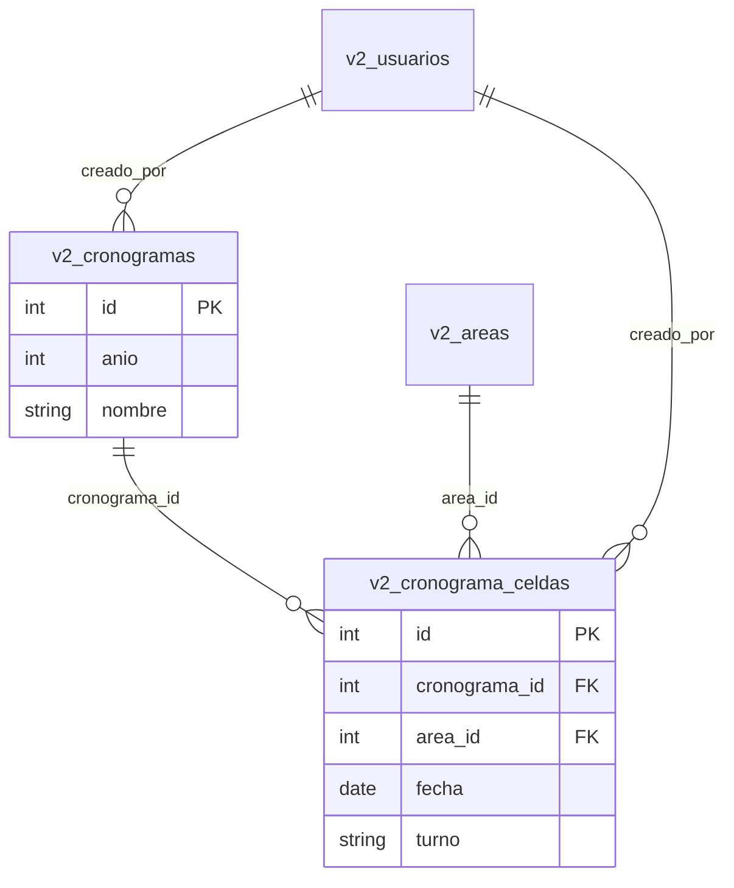

# Diseño — módulo Cronograma

**Prompt:** [D-007](../../prompts/02_diseno/D-007_cronograma_v1.md)  
**ADR:** [ADR-003](./adr/ADR-003-cronograma-documento-celdas.md)  
**Requisitos:** [R-006](../../prompts/01_requisitos/R-006_cronograma_anual_v1.md)  
**Impacto:** [impacto_cronograma.md](../05_mantenimiento/impacto_cronograma.md)  
**Producto:** incremento 8 cerrado (I-010 … I-017 / 0.10.7)

Este documento es diseño. No sustituye el código.

---

## 1. Entidades

### `v2_cronogramas` (historial)

| Columna | Tipo | Notas |
|---------|------|--------|
| `id` | INT PK AI | |
| `anio` | SMALLINT NOT NULL | Año de la campaña (p. ej. 2026) |
| `nombre` | VARCHAR(120) NOT NULL | Identificador visible (“Preventivo 1”, “Campaña set–dic”) |
| `notas` | TEXT NULL | Opcional |
| `creado_por` | INT FK `v2_usuarios` | SET NULL |
| `creado_en` | TIMESTAMP | Default current |

Varios registros pueden compartir `anio`. No hay UNIQUE(anio).

### `v2_cronograma_celdas` (asiento de cine)

| Columna | Tipo | Notas |
|---------|------|--------|
| `id` | INT PK AI | |
| `cronograma_id` | INT FK | ON DELETE CASCADE |
| `area_id` | INT FK `v2_areas` | ON DELETE CASCADE |
| `fecha` | DATE NOT NULL | Debe caer en `anio` del padre (validar en API) |
| `cantidad` | TINYINT UNSIGNED | Xn = n PC/laptop ese día (mín. 1) |
| `turno` | ENUM('Manana','Tarde') | Residual; no se muestra (I-014) |
| `hora_inicio` / `hora_fin` | TIME | Default según turno |
| `creado_por` | INT FK | SET NULL |
| `creado_en` | TIMESTAMP | |

**Unicidad:** `(cronograma_id, area_id, fecha)`. Xn no es turno: es la cantidad de PC/laptop de ese día. No hay una columna por equipo.

### Conteos (no se guardan)

Al armar la matriz, por cada `v2_areas` (orden: gerencia.orden, luego nombre de área; sin gerencia al final):

- `pc` = equipos `tipo_equipo = 'CPU'` y `estado_operativo <> 'Baja'`
- `laptop` = `Laptop`
- `impresora` = `Impresora`

Monitor/Otro no entran en esas tres columnas.

### Lo que no se toca

- `v2_cronograma_mantenimiento` (por equipo): sin lecturas ni escrituras en I-010.
- `v2_fichas_mantenimiento`: marcar celda no inserta ficha.

---

## 2. Contrato API

Base: `/api/v2`. JSON `{ success, data, message }`. JWT en todas. Escritura: `AuthMiddleware::requireRole('Administrador', 'Tecnico')`.

| Método | Ruta | Auth | Notas |
|--------|------|------|-------|
| GET | `/cronogramas` | JWT | Query `anio` opcional. Historial, más reciente primero |
| POST | `/cronogramas` | JWT + Tec/Admin | `{ anio, nombre, notas? }` → 201 `{ id }` |
| GET | `/cronogramas/{id}` | JWT | Cabecera + `filas` (área, gerencia, conteos, celdas). Si hay gerencias asignadas, UI/PDF insertan banda |
| POST | `/cronogramas/{id}/celdas` | JWT + Tec/Admin | `{ area_id, fecha, cantidad }` upsert. cantidad 0 libera. 400 si `fecha` no es del `anio` o si cantidad > PC+laptop |
| DELETE | `/cronogramas/{id}/celdas/{celdaId}` | JWT + Tec/Admin | Libera el asiento |
| GET | `/cronogramas/{id}/cobertura` | JWT | Áreas con PC/laptop cuya suma de Xn aún no cubre ese parque |
| GET | `/reportes/cronograma/{id}` | JWT | PDF A4 apaisado: 2 meses/hoja, L–V, marca Xn; PC/LAPTOP/IMPRESORA; HORA PROGRAMADA con borde. Fechas = `anio` del documento |
| DELETE | `/cronogramas/{id}` | JWT + Tec/Admin | Elimina el plan (CASCADE) |
| PUT | `/cronogramas/{id}/celdas/{celdaId}/horarios` | JWT + Tec/Admin | `{ horarios: [{ equipo_id, hora_inicio, hora_fin }] }` |
| PUT | `/cronogramas/{id}/personal` | JWT + Tec/Admin | `{ personal: [{ nombre, hora_inicio, hora_fin }] }` |

Practicante: GET 200; POST/DELETE 403.

Rango de días de la matriz: 1 ene–31 dic del `anio` del documento, o el menor rango que cubra las celdas existentes **más** un mes de margen. I-010 puede usar **todo el año** con scroll horizontal; si el rendimiento molesta, recortar en un parche, no en el ADR.

---

## 3. Frontend

| Ruta | Pantalla | Guard |
|------|----------|-------|
| `/v2/cronograma` | Historial (HU-CRN-007, 008, 009) | `PrivateRoute` |
| `/v2/cronograma/:id` | Matriz del documento (HU-CRN-001–006) | `PrivateRoute` |

Navbar: etiqueta **Cronograma** (junto a Mantenimiento).

Feature: `src/features/cronograma/` (`CronogramaListPage`, `CronogramaMatrizPage`, `cronogramaService.js`). PDF desde la matriz, no un feature `reportes/`.

**Historial:** tabla o tarjetas: nombre, año, fecha de registro, quién creó. Filtro por año. Botón crear (oculto o deshabilitado si rol Practicante).

**Matriz:** filas = áreas. **Una columna por día**; la celda muestra Xn. Clic abre selector X1…Xn (n = PC+laptop). Pie Subtotal/Total. Panel HORA PROGRAMADA (personas).

**Cobertura:** áreas cuya suma de Xn aún no cubre PC+laptop del inventario.

No auto-rellenar. No incrustar timeline de fichas.

---

## 4. Trazabilidad HU → diseño

| HU | Diseño |
|----|--------|
| HU-CRN-001 | GET `/{id}` matriz |
| HU-CRN-002 | POST celdas |
| HU-CRN-003 | DELETE celdas |
| HU-CRN-004 | GET `/reportes/cronograma/{id}` |
| HU-CRN-005 | Filas desde `v2_areas` (alta en Configuración) |
| HU-CRN-006 | GET cobertura |
| HU-CRN-007 | Navbar + `/v2/cronograma` |
| HU-CRN-008 | GET listado |
| HU-CRN-010 | Pie y columna Tot |
| HU-CRN-011 | PUT horarios; tabla `v2_cronograma_horarios` |

---

## 5. Fuera de I-010

- Dual-write a `v2_cronograma_mantenimiento`
- Generación automática de celdas
- Integración SIGA/SAF
- Borrado masivo de documentos (no hay HU; se puede dejar sin DELETE del padre)
- Copiar un cronograma a otro año
