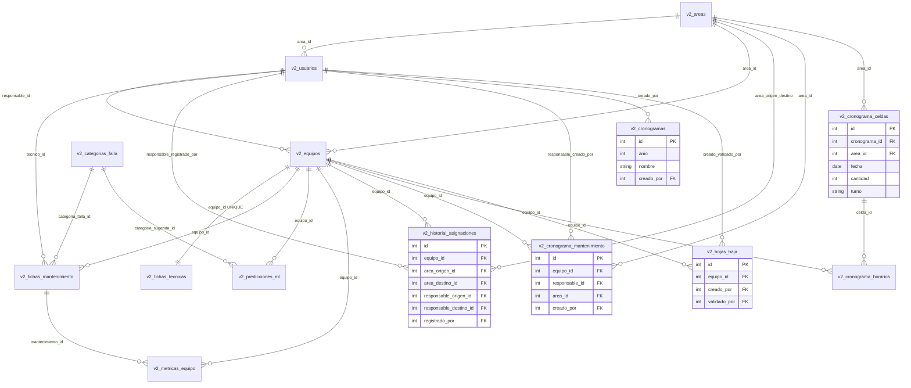

# Modelo entidad-relación V2 (as-built)

**Prompt:** [D-001 v2](../../prompts/02_diseno/D-001_modelo_datos_v2_refinado.md)  
**Origen:** FK de `backend/sql/v2_estructura.sql`, `v2_ml_predicciones.sql`, `v2_metricas_equipo.sql`  
**Producto:** esquema 0.9.1  
**No es un rediseño.** Si el SQL y este diagrama discrepan, manda el SQL.

---

## Cardinalidades (del DDL)

| Relación | Tipo | Evidencia SQL |
|----------|------|----------------|
| `v2_equipos` ↔ `v2_fichas_tecnicas` | 1:1 | `equipo_id UNIQUE NOT NULL` |
| `v2_gerencias` → `v2_areas` | 1:N | `gerencia_id` FK, `ON DELETE SET NULL` |
| `v2_areas` → `v2_equipos` | 1:N | `area_id` FK, NOT NULL |
| `v2_usuarios` → `v2_equipos` | 1:N | `responsable_id` FK, `ON DELETE SET NULL` |
| `v2_areas` → `v2_usuarios` | 1:N | `area_id` FK, `ON DELETE SET NULL` |
| `v2_equipos` → `v2_fichas_mantenimiento` | 1:N | `equipo_id` FK, `ON DELETE CASCADE` |
| `v2_categorias_falla` → `v2_fichas_mantenimiento` | 1:N | `categoria_falla_id` FK, `ON DELETE SET NULL` |
| `v2_usuarios` → `v2_fichas_mantenimiento` | 1:N | `tecnico_id` FK |
| `v2_equipos` → `v2_predicciones_ml` | 1:N | `equipo_id` FK, `ON DELETE CASCADE` |
| `v2_categorias_falla` → `v2_predicciones_ml` | 1:N | `categoria_sugerida_id` FK |
| `v2_equipos` → `v2_metricas_equipo` | 1:N | `equipo_id` FK, `ON DELETE CASCADE` |
| `v2_fichas_mantenimiento` → `v2_metricas_equipo` | 1:N | `mantenimiento_id` FK, `ON DELETE SET NULL` |

FastAPI no aparece: no tiene tablas propias.

---

## Figura 1 — Núcleo (tesis)

```mermaid
erDiagram
  v2_gerencias ||--o{ v2_areas : "gerencia_id"
  v2_areas ||--o{ v2_usuarios : "area_id"
  v2_areas ||--o{ v2_equipos : "area_id"
  v2_usuarios ||--o{ v2_equipos : "responsable_id"
  v2_equipos ||--|| v2_fichas_tecnicas : "equipo_id UNIQUE"
  v2_equipos ||--o{ v2_fichas_mantenimiento : "equipo_id"
  v2_usuarios ||--o{ v2_fichas_mantenimiento : "tecnico_id"
  v2_categorias_falla ||--o{ v2_fichas_mantenimiento : "categoria_falla_id"
  v2_equipos ||--o{ v2_predicciones_ml : "equipo_id"
  v2_categorias_falla ||--o{ v2_predicciones_ml : "categoria_sugerida_id"
  v2_equipos ||--o{ v2_metricas_equipo : "equipo_id"
  v2_fichas_mantenimiento ||--o{ v2_metricas_equipo : "mantenimiento_id"

  v2_gerencias {
    int id PK
    string nombre UK
  }
  v2_areas {
    int id PK
    string nombre UK
    int gerencia_id FK
  }
  v2_usuarios {
    int id PK
    string usuario UK
    string rol
    int area_id FK
  }
  v2_equipos {
    int id PK
    string codigo_patrimonial UK
    int ram_gb
    int area_id FK
    int responsable_id FK
  }
  v2_fichas_tecnicas {
    int id PK
    int equipo_id FK_UK
  }
  v2_categorias_falla {
    int id PK
    string nombre
    string severidad
  }
  v2_fichas_mantenimiento {
    int id PK
    int equipo_id FK
    int tecnico_id FK
    int categoria_falla_id FK
  }
  v2_predicciones_ml {
    int id PK
    int equipo_id FK
    int categoria_sugerida_id FK
  }
  v2_metricas_equipo {
    int id PK
    int equipo_id FK
    int mantenimiento_id FK
  }
```

---

## Figura 2 — Esquema completo

Incluye historial de asignaciones, cronograma e hojas de baja (mismas fuentes SQL).



`v2_historial_asignaciones` y `v2_cronograma_mantenimiento` / `v2_hojas_baja` concentran varias FK a `v2_usuarios` y `v2_areas`; en Mermaid se agrupan en una arista por par de entidades para no saturar el dibujo. El detalle está en los atributos y en el SQL.

Incremento 8: `v2_cronogramas` + `v2_cronograma_celdas` (asiento área+fecha+**cantidad** Xn, I-014) + `v2_cronograma_personal` (I-013). `v2_cronograma_mantenimiento` **no** se usa. `turno` en celdas es residual.
