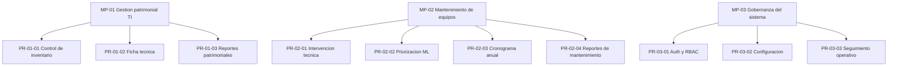

# Inventario de procesos — Sigemad MPA V2

**Norma de ancla:** ISO 9001:2015 cl. 4.4 (procesos) y 7.5 (información documentada).  
**Producto:** 0.10.7.  
**Uso:** columnas 1–7 de [MATRIZ-DOBLE-ENTRADA-V4](../../matriz_doble_entrada/MATRIZ-DOBLE-ENTRADA-V4-SIGEMAD-MPA.xlsx).  
**Prompt del procedimiento:** el BPMN Bizagi aún no tiene prompt versionado → `N/A` hasta que exista un `P-ISO-*` en `prompts/`.

Jerarquía: **MP → PR → ACT → F-NNN**. Una función atómica no es un procedimiento.

---

## Mapa

---

## MP-01 — Gestión patrimonial de activos TI

Objetivo: dar de alta, consultar y documentar bienes TI con código patrimonial de 12 dígitos.

| ID PR | Procedimiento | ID ACT | Actividad | Funciones | Automatizado |
|-------|---------------|--------|-----------|-----------|--------------|
| PR-01-01 | Control de inventario | ACT-01-01-01 | Consultar y filtrar inventario | F-014, F-017 | Sí |
| PR-01-01 | Control de inventario | ACT-01-01-02 | Registrar o actualizar equipo | F-015, F-016 | Sí |
| PR-01-01 | Control de inventario | ACT-01-01-03 | Incorporar lote por Excel | F-018, F-019 | Sí |
| PR-01-01 | Control de inventario | ACT-01-01-04 | Mostrar riesgo ML en el listado | F-020 | Parcial (FastAPI) |
| PR-01-02 | Administrar ficha técnica | ACT-01-02-01 | Buscar y consultar ficha | F-021, F-022 | Sí |
| PR-01-02 | Administrar ficha técnica | ACT-01-02-02 | Evaluar estado técnico | F-023 | Sí |
| PR-01-02 | Administrar ficha técnica | ACT-01-02-03 | Consultar bloque predictivo | F-024 | Parcial (FastAPI) |
| PR-01-03 | Emitir reportes patrimoniales | ACT-01-03-01 | Generar PDF de ficha de equipo | F-038 | Sí |
| PR-01-03 | Emitir reportes patrimoniales | ACT-01-03-02 | Descargar PDF autenticado | F-041 | Sí |

---

## MP-02 — Mantenimiento de equipos

Objetivo: registrar intervenciones, priorizar con ML opcional y programar el preventivo anual (Xn).

| ID PR | Procedimiento | ID ACT | Actividad | Funciones | Automatizado |
|-------|---------------|--------|-----------|-----------|--------------|
| PR-02-01 | Intervención técnica | ACT-02-01-01 | Consultar timeline y detalle | F-025, F-027 | Sí |
| PR-02-01 | Intervención técnica | ACT-02-01-02 | Registrar ficha de mantenimiento | F-026 | Sí |
| PR-02-01 | Intervención técnica | ACT-02-01-03 | Consultar historial por código | F-028 | Sí |
| PR-02-01 | Intervención técnica | ACT-02-01-04 | Sincronizar telemetría y categoría | F-029, F-030 | Parcial (ML en categoría) |
| PR-02-02 | Priorización predictiva | ACT-02-02-01 | Predecir riesgo (unidad / lote) | F-034, F-035 | Parcial (FastAPI) |
| PR-02-02 | Priorización predictiva | ACT-02-02-02 | Operar con ML degradado | F-036 | Sí (ADR-002) |
| PR-02-02 | Priorización predictiva | ACT-02-02-03 | Reentrenar el modelo | F-037 | Parcial (Admin + FastAPI) |
| PR-02-03 | Programación anual de preventivo | ACT-02-03-01 | Gestionar documento de cronograma | F-043, F-044, F-049 | Sí |
| PR-02-03 | Programación anual de preventivo | ACT-02-03-02 | Marcar Xn y totales | F-045, F-046, F-047 | Sí |
| PR-02-03 | Programación anual de preventivo | ACT-02-03-03 | Asignar personal y bandas de gerencia | F-048, F-050 | Sí |
| PR-02-03 | Programación anual de preventivo | ACT-02-03-04 | Cobertura mínima y PDF A4 | F-051, F-042 | Sí |
| PR-02-04 | Reportes de mantenimiento | ACT-02-04-01 | PDF de historial | F-039 | Sí |
| PR-02-04 | Reportes de mantenimiento | ACT-02-04-02 | PDF de detalle de intervención | F-040 | Sí |

---

## MP-03 — Gobernanza del sistema

Objetivo: controlar acceso, catálogos organizacionales e indicadores. No es un proceso de negocio patrimonial; es soporte (ISO 9001 cl. 4.4 / 7).

| ID PR | Procedimiento | ID ACT | Actividad | Funciones | Automatizado |
|-------|---------------|--------|-----------|-----------|--------------|
| PR-03-01 | Autenticación y control de acceso | ACT-03-01-01 | Iniciar, persistir y cerrar sesión | F-001, F-002, F-003 | Sí |
| PR-03-01 | Autenticación y control de acceso | ACT-03-01-02 | Proteger API y autorizar por rol | F-004, F-005 | Sí |
| PR-03-02 | Configuración organizacional | ACT-03-02-01 | Gestionar áreas | F-006, F-007, F-008, F-009 | Sí |
| PR-03-02 | Configuración organizacional | ACT-03-02-02 | Gestionar personal | F-010, F-011, F-012 | Sí |
| PR-03-02 | Configuración organizacional | ACT-03-02-03 | Gestionar gerencias | F-013 | Sí |
| PR-03-03 | Seguimiento operativo | ACT-03-03-01 | Consultar indicadores | F-031 | Sí |
| PR-03-03 | Seguimiento operativo | ACT-03-03-02 | Alertas predictivas y consulta por etiquetas | F-032, F-033 | Parcial (alertas = FastAPI) |

---

## Cómo copiar a la matriz V4

Por cada fila F-NNN:

1. **ID Proceso / Proceso** = MP-* de la tabla.
2. **ID Procedimiento / Procedimiento** = PR-*.
3. **ID Prompt (Procedimiento)** = `N/A` hasta existir el prompt Bizagi.
4. **ID Actividad / Actividad** = ACT-*.
5. El resto (prompt I-*, commit, archivo) sigue viniendo de [`_funciones_atomicas.py`](../../matriz_doble_entrada/_funciones_atomicas.py).
6. **SonarQube** = No / No aplica hasta guardar evidencia en [`documents/06_calidad/sonarqube/evidencias/`](../../06_calidad/sonarqube/evidencias/).
