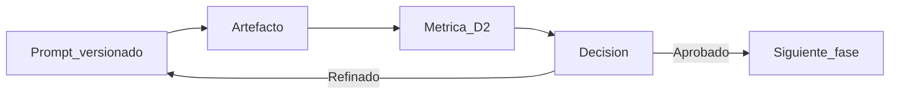
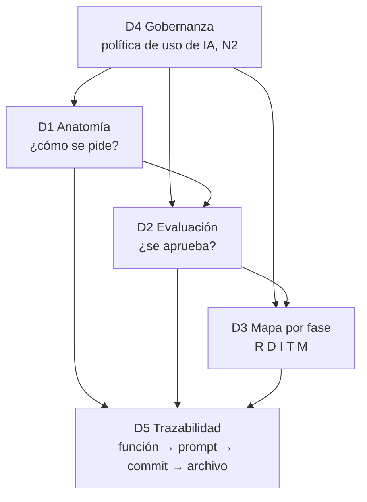
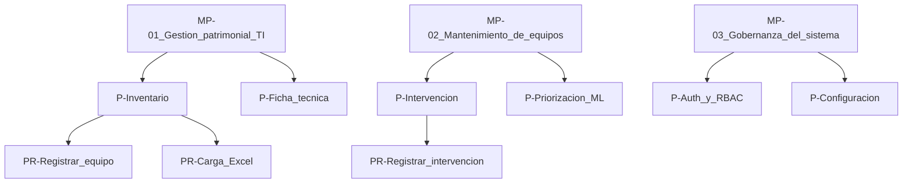
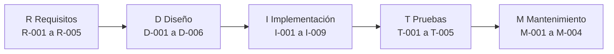
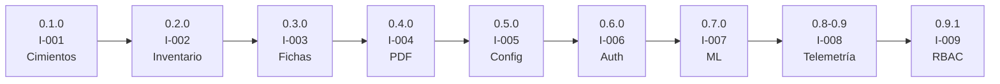
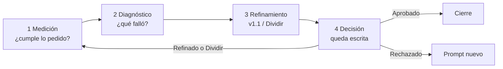
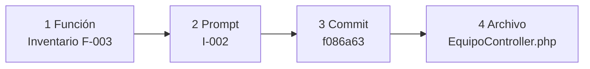

# Plantillas de figuras y tablas — Anexo 07

Estructuras de ejemplo para rellenar. Las celdas con datos de Sigemad son **borrador**; las marcadas `[completar]` o `[pegar desde Bizagi]` las llena el tesista.

En Word: copiar la tabla, título debajo (Continental), citarla en el párrafo anterior. Las figuras Mermaid se redibujan en PowerPoint, draw.io o se exportan a PNG.

Índice del anexo: [Anexo07_Indice_Desarrollo_Metodologico.md](./Anexo07_Indice_Desarrollo_Metodologico.md).

---

## A7.1 Introducción

### Figura A7-1. Cadena de la intervención



**Título:** Figura A7-1. Cadena de la intervención metodológica: prompt, artefacto, métrica y decisión.  
**Fuente:** Elaboración propia a partir de Prompt-Centered SDLC v1.2.

---

### Figura A7-2. Dimensiones D1–D5 y evidencia en Sigemad

Se lee de arriba abajo: D4 (gobernanza / política de IA) es el techo; D1–D3 operan el prompt por fase; D5 es la traza auditable.



**Título:** Figura A7-2. Cinco dimensiones del Prompt-Centered SDLC: gobernanza (D4), trabajo del prompt (D1–D3) y trazabilidad (D5).  
**Fuente:** Elaboración propia.

---

### Tabla A7-1. Objetivos específicos de la intervención × evidencia

| N.º | Objetivo específico de la intervención | Evidencia | Apartado |
|-----|----------------------------------------|-----------|----------|
| OE-1 | Aplicar anatomía D1 en todas las fases del SDLC | 29 registros vigentes con checklist D1 | A7.4, A7.5 |
| OE-2 | Evaluar salidas con ciclo D2 y dejar decisión documentada | `registro_metricas.md` | A7.6 |
| OE-3 | Trazar cada incremento de implementación a un prompt I-* | I-001 … I-009; incrementos 0.1.0–0.9.1 | A7.5.3 |
| OE-4 | Construir la matriz de doble entrada función–prompt–commit | F-001 … F-008 + Excel V3 | A7.7 |
| OE-5 | Aplicar guardrails y política de uso de IA | `politicas_uso_ia.md` | A7.9 |
| OE-6 | Dejar trazabilidad HU → prompt → código → test | Tabla A7-19 | A7.10 |

---

## A7.2 Justificación

### Tabla A7-2. Scrum frente a Prompt-Centered SDLC en este caso

| Limitación de Scrum en un desarrollo con IA sistemática | Qué se usó en Sigemad |
|---------------------------------------------------------|------------------------|
| El sprint dimensiona capacidad humana de implementación | Incrementos cerrados por módulo (0.1.0–0.9.1), sin caja de dos semanas |
| Daily / Planning / Review / Retro asumen coordinación de implementadores | Revisión humana de la salida del modelo (aprobar / rechazar / refinar) |
| El backlog de sprint es la traza principal | Traza: prompt → artefacto → métrica → decisión |
| Historias “estimables en un sprint” | Historias como técnica de requisitos; se cierran cuando hay DoD + D2 |

**Fuente:** Elaboración propia a partir de Hymel; Shrivastava et al. (2025); `documents/metodologia.md`.

---

### Tabla A7-3. Fases del Prompt-Centered SDLC × ISO/IEC 25000

| Fase | Código de prompts | Característica ISO/IEC 25000 (producto) | Qué se produjo en Sigemad |
|------|-------------------|-----------------------------------------|---------------------------|
| Requisitos | R-001 … R-005 | Adecuación funcional | Ficha, 56 HU, personas, ambigüedades, RNF |
| Diseño | D-001 … D-006 | Mantenibilidad (modularidad, analizabilidad) | ER, ADR-001, ADR-002, contrato API |
| Implementación | I-001 … I-009 | Eficiencia en el desempeño | Incrementos 0.1.0–0.9.1 |
| Pruebas | T-001 … T-005 | Adecuación funcional (corrección funcional) | Plan funcional, PHPUnit, Vitest, pytest |
| Mantenimiento | M-001 … M-004 | Mantenibilidad (modificabilidad y restauración) | Puesta en producción, impacto, rollback |

**Nota:** de la familia SQuaRE (ISO/IEC 25000) se retienen tres características de calidad del producto: adecuación funcional, mantenibilidad y eficiencia.

---

### Tabla A7-4. Literatura de IA en el SDLC: aporta / no cubre / brecha

| Fuente | Qué aporta | Qué no cubre | Brecha que cierra el Prompt-Centered en este caso |
|--------|------------|--------------|---------------------------------------------------|
| Yas, Alazzawi y Rahmatullah (2023) | Fases estables del SDLC; Scrum es un modelo ágil más | IA y prompt como artefacto | Se conservan R/D/I/T/M; la IA entra dentro de cada fase |
| Paladino y Pons (2025) | IA transversal al SDLC; barreras técnicas, organizacionales y éticas | Prompt versionado, D2 y traza Git | Política de IA (D4), N2 y revisión humana |
| Hymel (V-Bounce) | El sprint deja de calibrar; humano como validador | Instrumento prompt–commit–archivo (white paper) | Incremento acotado + registro D2 |
| Wang et al. | Prompt poco normativo aumenta código inseguro | Versionado del prompt y caso PHP municipal | Anatomía D1, bloque «No hacer», secretos fuera |
| Esposito et al. (2026) | GenAI en arquitectura; salidas casi nunca se evalúan con rigor | Ciclo completo y repositorio de prompts | D2 sobre ADR y diseño antes de implementar |

---

## A7.3 Proyecto y procesos

### Tabla A7-5. Ficha del proyecto Sigemad MPA V2

| Campo | Contenido |
|-------|-----------|
| Nombre | Sigemad MPA — Gestión de equipos y mantenimiento predictivo |
| Código | SIGEMAD-MPA-V2 |
| Entidad | Municipalidad Provincial de Acobamba (unidad de informática / patrimonio TI) |
| Versión de producto | 0.9.1 |
| Objetivo | Inventario patrimonial, fichas, historial de mantenimiento y ML opcional de riesgo |
| Usuarios | Administrador, Técnico, Practicante |
| Stack | React 19 + Vite, PHP 8.1+ REST, MySQL, FastAPI/Scikit-learn (opcional) |
| Fuera de alcance | Portal ciudadano, bienes no TI, SIGA/SIAF, ML obligatorio en producción |
| Metodología de construcción | Prompt-Centered SDLC v1.2 |
| Herramienta de IA | Cursor Agent |
| Nivel de automatización | N2 (asistido; revisión humana obligatoria) |

---

### Tabla A7-6. Identificación de procesos (macroprocesos y procedimientos)

Rellenar con **tu inventario ya hecho**. Una fila = un procedimiento. Ejemplo de columnas:

| Código | Macroproceso | Proceso | Procedimiento | Objetivo | Responsable | Entradas | Salidas | ¿Automatizado en Sigemad? |
|--------|--------------|---------|---------------|----------|-------------|----------|---------|---------------------------|
| MP-01 / P-01 / PR-01 | Gestión patrimonial de activos TI | Control de inventario | Registrar equipo con código patrimonial | Dar de alta un bien TI trazable | Técnico / Admin | Datos del equipo, área | Registro en `v2_equipos` | Sí (módulo Inventario) |
| MP-01 / P-01 / PR-02 | Gestión patrimonial de activos TI | Control de inventario | Carga masiva por Excel | Incorporar lotes | Administrador | Plantilla Excel | Resumen de importación | Sí (I-009) |
| MP-02 / P-02 / PR-01 | Mantenimiento de equipos | Intervención técnica | Registrar ficha de mantenimiento | Documentar preventivo/correctivo/predictivo | Técnico | Código patrimonial, telemetría o síntoma | Ficha + PDF | Sí (módulo Mantenimiento) |
| MP-02 / P-03 / PR-01 | Mantenimiento de equipos | Priorización predictiva | Consultar riesgo ML del equipo | Ordenar intervenciones | Técnico / Admin | Features del equipo + modelo | Score y nivel de riesgo | Parcial (requiere FastAPI) |
| [completar] | [completar] | [completar] | [completar] | [completar] | [completar] | [completar] | [completar] | Sí / Parcial / No |

Valores de la última columna: **Sí** (flujo en Sigemad) · **Parcial** (existe pero depende de ML o de un rol) · **No** (sigue siendo manual).

---

### Figura A7-3. Jerarquía de procesos



Sustituye los nodos por **tus** códigos de macroproceso.

---

### Figuras A7-4 y A7-5. BPMN (BIZAGI)

No se redibujan en Mermaid para la tesis. En el cuerpo:

| Figura | Contenido | Dónde se pega | Qué escribir debajo |
|--------|-----------|---------------|---------------------|
| A7-4 | Export PNG del BPMN **as-is** (gestión actual) | A7.3.5 | Figura A7-4. Diagrama de proceso as-is. Fuente: elaboración propia en Bizagi. |
| A7-5 | Export PNG del BPMN **to-be** (flujo Sigemad) | A7.3.5 | Figura A7-5. Diagrama de proceso to-be. Fuente: elaboración propia en Bizagi. |
| Opcional | Un procedimiento (p. ej. registrar intervención) | A7.3.5 o Apéndice G | Si hay más de 4, el resto al Apéndice G |

Recuadro para el Word (mientras pegas el PNG):

```text
+----------------------------------------------------------+
|  [PEGAR AQUÍ el export de Bizagi — as-is / to-be]        |
|  Resolución: ancho de página útil (~15 cm).              |
|  No uses captura de la ventana de Bizagi; usa Export.    |
+----------------------------------------------------------+
```

---

## A7.4 Preparación

**GitHub:** [https://github.com/AxlTech25/Gestion-MPA/tree/main/prompts](https://github.com/AxlTech25/Gestion-MPA/tree/main/prompts)

### Figura A7-6. Árbol del repositorio de prompts

```text
prompts/
├── 01_requisitos/          R-001 … R-005
├── 02_diseno/              D-001 … D-006
├── 03_implementacion/      I-001 … I-009  (+ 2 Superados)
├── 04_testing/             T-001 … T-005
├── 05_mantenimiento/       M-001 … M-004
└── gobernanza/
    ├── _plantilla_prompt.md
    ├── catalogo.md
    ├── politicas_uso_ia.md
    └── registro_metricas.md
```

**Título:** Figura A7-6. Estructura del repositorio de prompts del caso Sigemad MPA.  
**Fuente:** Elaboración propia a partir de `prompts/README.md`.

---

### Tabla A7-7. Definition of Done ampliada

| N.º | Criterio | ¿Se exige en Sigemad? | Evidencia |
|-----|----------|------------------------|-----------|
| 1 | Criterios de aceptación verificables | Sí | HU + incremento |
| 2 | Prompt (si hubo IA) versionado en `prompts/` | Sí | Catálogo D3 |
| 3 | Revisión humana de lo integrado | Sí | Campo Revisor del registro |
| 4 | Pruebas relevantes en verde | Sí | T-002 / T-003 / T-004 |
| 5 | Sin secretos en el repositorio | Sí | Política + M-004 |
| 6 | Documentación de la fase actualizada | Sí | `documents/0N_*/` |
| 7 | ADR si cambió la arquitectura | Sí | ADR-001, ADR-002 |
| 8 | Trazabilidad HU → incremento → versión → módulo | Sí | Matriz + A7.10 |

---

### Tabla A7-8. Herramienta / modelo × fase

| Herramienta o modelo | Uso principal | Fase(s) |
|----------------------|---------------|---------|
| Cursor Agent | Generación y refinamiento de artefactos | R, D, I, T, M |
| [completar: modelo, p. ej. el que figure en los registros] | [completar] | [completar] |
| GitHub | Versionado de código y SHA de evidencia | I, T, M |
| PHPUnit / Vitest / pytest | Ejecución de pruebas (el humano corre e interpreta) | T |
| Bizagi | Modelado BPMN de procesos institucionales | Entrada de R (A7.3) |

---

## A7.5 Aplicación por fases

### Figura A7-7. Ciclo R–D–I–T–M con códigos vigentes

Clave: **R** = Requisitos · **D** = Diseño · **I** = Implementación · **T** = Pruebas (Testing) · **M** = Mantenimiento. El número (R-001, I-002…) identifica el prompt vigente de esa fase.



**Título:** Figura A7-7. Ciclo de vida R–D–I–T–M (Requisitos, Diseño, Implementación, Pruebas, Mantenimiento) y familia de prompts vigentes.

---

### Figura A7-8. Línea de incrementos

Cada recuadro es una **versión de producto**. I-* es el prompt de la fase de **Implementación** que la construyó (I no significa “incremento” de forma aislada).



**Título:** Figura A7-8. Incrementos de producto (versiones 0.1.0 a 0.9.1) y prompt de implementación asociado. No son sprints Scrum.

---

### Tablas A7-9 a A7-13. Misma plantilla por fase

Columnas fijas (así el anexo se ve sistemático):

| Código | Técnica | Output / artefacto | Estado del registro | Decisión D2 |
|--------|---------|--------------------|---------------------|-------------|

**Tabla A7-9. Fase de requisitos (ejemplo parcialmente lleno)**

| Código | Técnica | Output / artefacto | Estado del registro | Decisión D2 |
|--------|---------|--------------------|---------------------|-------------|
| R-001 | [completar: p. ej. few-shot] | `ficha-proyecto.md` | Reconstruido | Aprobado |
| R-002 | [completar] | 56 HU / 8 épicas | Reconstruido | Aprobado |
| R-003 | [completar] | `personas.md` | Reconstruido | Aprobado |
| R-004 | [completar] | `ambiguedades.md` | Ejecutado | Aprobado |
| R-005 | [completar] | `requisitos_no_funcionales.md` | Ejecutado | Aprobado |

**Tabla A7-10. Fase de diseño** — mismas columnas + **ADR**

| Código | Técnica | Output / artefacto | ADR | Estado | Decisión D2 |
|--------|---------|--------------------|-----|--------|-------------|
| D-001 | [completar] | `v2_estructura.sql` | — | Reconstruido | Aprobado |
| D-001 v2 | [completar] | `er_v2.md` | — | Ejecutado | Aprobado |
| D-002 | [completar] | Stack | ADR-001 | Reconstruido | Aprobado |
| D-003 | [completar] | `contrato_api_v2.md` | — | Ejecutado | Aprobado |
| D-004 | [completar] | `frontend_features.md` | — | Ejecutado | Aprobado |
| D-005 | [completar] | Análisis ML | — | Reconstruido | Aprobado |
| D-006 | [completar] | Degradación FastAPI | ADR-002 | Ejecutado | Aprobado |

**Tabla A7-11. Fase de implementación**

| Código | Incremento / versión | Output principal | Estado | Decisión D2 |
|--------|----------------------|------------------|--------|-------------|
| I-001 | 1 / 0.1.0 | Cimientos, API, DDL | Reconstruido | Aprobado |
| I-002 | 2 / 0.2.0 | CRUD inventario | Reconstruido | Aprobado |
| I-003 | 3 / 0.3.0 | Fichas y mantenimiento | Reconstruido | Aprobado |
| I-004 | 4 / 0.4.0 | Reportes PDF | Reconstruido | Aprobado |
| I-005 | 5 / 0.5.0 | Configuración | Reconstruido | Aprobado |
| I-006 | — / 0.6.0 | Auth JWT + dashboard | Reconstruido | Aprobado |
| I-007 | 6 / 0.7.0 | Microservicio ML | Reconstruido | Aprobado |
| I-008 | 7 / 0.8.0–0.9.0 | Telemetría y ficha predictiva | Reconstruido | Aprobado |
| I-009 | Parche / 0.9.1 | RBAC + plantilla Excel | Reconstruido | Aprobado |

**Tabla A7-12. Fase de pruebas**

| Código | Runner o entregable | Output | Estado | Decisión D2 |
|--------|---------------------|--------|--------|-------------|
| T-001 | Plan funcional (humano) | `plan_pruebas_funcionales.md` | Reconstruido | Aprobado |
| T-002 | PHPUnit | `backend/tests/` | Reconstruido | Aprobado |
| T-003 | Vitest | `src/lib/*.test.js` | Reconstruido | Aprobado |
| T-004 | pytest | `ml/tests/` | Reconstruido | Aprobado |
| T-005 | Plantilla de diagnóstico | `diagnostico_test_fallido.md` | Plantilla | Aprobado |

**Tabla A7-13. Fase de mantenimiento**

| Código | Output | Estado | Decisión D2 |
|--------|--------|--------|-------------|
| M-001 | `produccion.md` (despliegue) | Reconstruido | Aprobado |
| M-002 | Plantilla de análisis de impacto | Plantilla | Aprobado |
| M-003 | Plantilla de documentación post-cambio | Plantilla | Aprobado |
| M-004 | Rollback y secretos en `produccion.md` | Ejecutado | Aprobado |

---

### Tabla A7-14. Incremento × versión × SHA × módulo

| Función | Módulo | Prompt | Commit | Archivo ancla |
|---------|--------|--------|--------|---------------|
| F-001 | auth | I-006 | 5ce7575 | `src/features/auth/Login.jsx` |
| F-002 | configuracion | I-005 | 4e08b9e | `ConfiguracionPage.jsx` |
| F-003 | inventario | I-002 | f086a63 | `EquipoController.php` |
| F-004 | ficha | I-003 | f086a63 | `FichaTecnicaController.php` |
| F-005 | mantenimiento | I-003 | 8b20337 | `MantenimientoController.php` |
| F-006 | dashboard | I-006 | 5ce7575 | `DashboardPage.jsx` |
| F-007 | ml | I-007 | e9a0965 | `ml/app/main.py` |
| F-008 | reportes | I-004 | f086a63 | `ReporteController.php` |

Evoluciones: I-008 (telemetría) e I-009 (RBAC) se anotan como fila extra o nota al pie, no se borra el SHA de origen.

---

## A7.6 Ciclo D2

### Figura A7-9. Ciclo D2

El humano mide la salida, diagnostica el desvío, refina el prompt y deja una decisión escrita (Aprobado, Refinado, Rechazado, Superado).



---

### Tabla A7-15. Extracto del registro de versiones

| Código | Fase | Iteraciones de origen | Medición D2 | Decisión | Lección breve |
|--------|------|----------------------|-------------|----------|---------------|
| R-004 | Requisitos | [completar] | 14 hallazgos R-01 | Aprobado | Estado honesto (cerrado/supuesto) |
| D-006 | Diseño | 1 | ADR-002 opción D | Aprobado | Lo tácito no existe para la tesis |
| I-002 | Implementación | No medido | F-003 / HU-INV-001–002 | Aprobado | I-002 ya no es ML |
| I-007 | Implementación | ≥2 | Acc. 95 % / F1 0.92 (métrica de *modelo*, no de hipótesis) | Aprobado | Schema `{}` no `[]` |
| [completar más filas desde registro_metricas.md] | | | | | |

---

### Tabla A7-10 (refinamiento). Antes / después

Usa **un** caso. Recomendado: macro de implementación.

| Campo | Antes | Después |
|-------|-------|---------|
| Identificador | I-001-MACRO (`I-001_api_auth_inventario_v1.md`) | I-001 … I-009 (un prompt por incremento) |
| Problema | Un prompt cubría varios módulos; no se podían citar en el commit | Ambigüedad de ID (p. ej. I-002 inventario vs I-002-ML) |
| Decisión D2 | Superado | Aprobado (vigentes) |
| Lección | Un I-* = un incremento | Los macros no se borran; quedan en Superado |

Alternativa: I-002 inventario vs I-002-ML histórico.

---

## A7.7 Matriz de doble entrada

### Figura A7-11. Cadena de evidencia

Cada fila responde cuatro preguntas. Ejemplo: inventario (F-003) → prompt I-002 → commit f086a63 → EquipoController.php.



---

### Tabla A7-16. Extracto F-001…F-008

Es la misma grilla que A7-14. En el cuerpo del anexo **no** dupliques las dos: usa A7-14 en implementación y en A7.7 añade solo 2–3 columnas DevOps si las tienes en el Excel:

| Función | Prompt | Commit | Control de versiones | CI | Tests | Monitoreo |
|---------|--------|--------|----------------------|----|-------|-----------|
| F-003 | I-002 | f086a63 | Sí (GitHub) | [completar: Sí/Parcial/No] | [completar] | [completar] |
| F-007 | I-007 | e9a0965 | Sí | [completar] | pytest | [completar] |
| … | | | | | | |

Excel completo → Apéndice A.

---

## A7.8 Nivel agentico

### Figura A7-12. Escala N1–N5

```text
N1  Manual con copiar/pegar ocasional
N2  ●  Asistido / agentico acotado   ← este caso (Cursor Agent + revisión humana)
N3  Agente con más autonomía en un repo
N4  Agentes encadenados sin revisión por paso
N5  Autonomía amplia en producción
```

En Word: barra horizontal de 5 casillas; rellena solo N2.

---

### Tabla A7-17. Reglas de control

| Regla | Qué prohíbe o exige | Dónde está escrita |
|-------|---------------------|-------------------|
| Revisión humana obligatoria antes de integrar | Copiar código a ciegas | Política de IA |
| No secretos en el prompt ni en el repo | Credenciales, tokens | D1 «No hacer»; M-004 |
| Un I-* por incremento | Macros que mezclan módulos | Oleada 2 |
| Criterio de parada | Seguir iterando sin D2 | Decisión Aprobado / Rechazado / Dividir |
| No N4–N5 | Agentes sin supervisión en entidad pública | A7.8.2 |

---

## A7.9 Seguridad

### Tabla A7-18. Riesgo × guardrail × control posterior

| Riesgo | Guardrail en el prompt (D1) | Control posterior |
|--------|-----------------------------|-------------------|
| Alucinación de APIs o tablas | Restricciones + entradas (SQL/ADR existentes) | Revisión humana + pruebas |
| Secretos en el chat o en el repo | «No secretos» en No hacer | `local.php` fuera de git; M-004 |
| Alcance inflado (el modelo inventa módulos) | Tarea acotada al incremento; No hacer | DoD + un I-* por incremento |
| Código inseguro (p. ej. UI sin RBAC) | Criterios de aceptación | I-009 `requireRole`; tests |
| Propiedad intelectual / reescritura total | No reescribir V1 / no dependencias no autorizadas | Diff de GitHub |

---

## A7.10 Trazabilidad síntesis

### Tabla A7-19. HU → prompt → diseño → código → test → versión

| HU (ejemplo) | Prompt | Artefacto de diseño | Código | Test | Versión |
|--------------|--------|---------------------|--------|------|---------|
| HU-INV-001 / HU-INV-002 | I-002 | Contrato `/equipos`; ER `v2_equipos` | `EquipoController.php` | [completar: UT o caso funcional] | 0.2.0 |
| [completar HU-MANT-…] | I-003 | Ficha de mantenimiento | `MantenimientoController.php` | [completar] | 0.3.0 |
| [completar HU-ML-…] | I-007 | D-005, ADR-002 | `ml/app/main.py` | pytest T-004 | 0.7.0 |
| AUTH-005 / CFG-006 | I-009 | RBAC | `requireRole` + Navbar | T-002 | 0.9.1 |

Tres o cuatro filas bastan. El resto está en la matriz de HU.

---

## A7.11 Métricas de proceso

### Tabla A7-20. Tablero de indicadores de proceso

| Indicador | Valor | Umbral o criterio | Estado |
|-----------|-------|-------------------|--------|
| Historias de usuario implementadas | 56 | Alcance cerrado | OK |
| Incrementos de implementación | 7 + parche 0.9.1 | Trazables a I-* | OK |
| Prompts vigentes | 29 (R×5, D×6, I×9, T×5, M×4) | Mapa D3 por fase | OK |
| Prompts superados | 2 | No borrar | OK |
| Anatomía D1 completa | 29/29 | Plantilla maestra | OK |
| Ciclo D2 documentado | Sí; iteraciones de origen I-* no medidas en caliente | Decisión + lección | Parcial |
| ADR | 2 | Decisiones de arquitectura | OK |
| Reconstrucción vs ejecución | Mixto | Registrar *antes* el próximo cambio de código | Parcial |

---

### Figura A7-14. Prompts vigentes por fase

En Excel o Word (gráfico de barras). Datos:

| Fase | Vigentes |
|------|----------|
| Requisitos | 5 |
| Diseño | 6 |
| Implementación | 9 |
| Pruebas | 5 |
| Mantenimiento | 4 |

No incluir los 2 Superados en la barra (sí en una nota).

---

## A7.12 Lecciones

### Tabla A7-21. Hallazgo × mejora abierta

| Hallazgo en Sigemad / en la propuesta | Mejora abierta |
|---------------------------------------|----------------|
| Parte de los I-* se documentó a posteriori | Próximo cambio de código: registrar el prompt *antes* |
| I-001 fue un macro-prompt; iteraciones no medidas en caliente | Oleada 2 ya partió I-001…I-009; medir iteraciones en caliente de aquí en adelante |
| Un solo producto municipal no generaliza | Comparar con otro caso (p. ej. SGMI) o con un equipo Scrum clásico |
| ML opcional; FastAPI no es obligatorio en producción | El caso no cubre un SDLC de ML en producción |
| Nombres residuales de la etapa Scrum (`verify_sprint6_ml.py`) | Incremento de higiene, sin reescribir historia |

---

## Cómo rellenar sin inflar el anexo

1. Copia la plantilla al Word del Anexo 07, no dejes este archivo como entregable final.
2. En A7.5 usa **una** tabla por fase (A7-9 a A7-13), no una por prompt.
3. A7-14 y A7-16 no se duplican: elige una en el cuerpo y remite la otra.
4. A7-4 y A7-5 son tus PNG de Bizagi; aquí solo está el recuadro de anclaje.
5. Donde diga `[completar]` busca el dato en el registro del prompt (técnica, iteraciones) o en tu catálogo de procesos.
